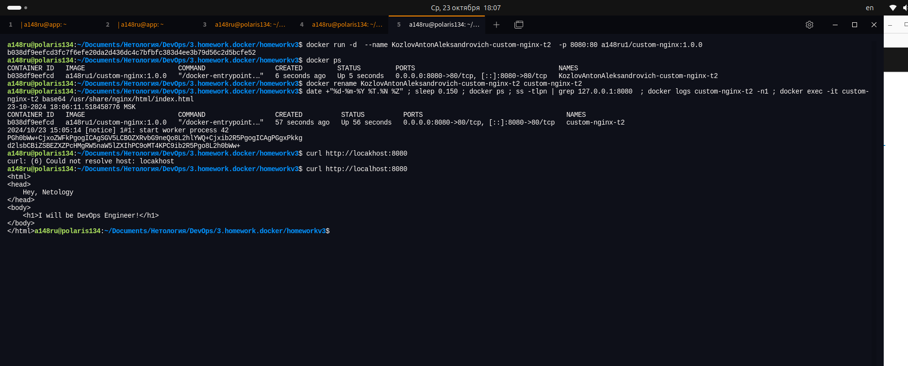
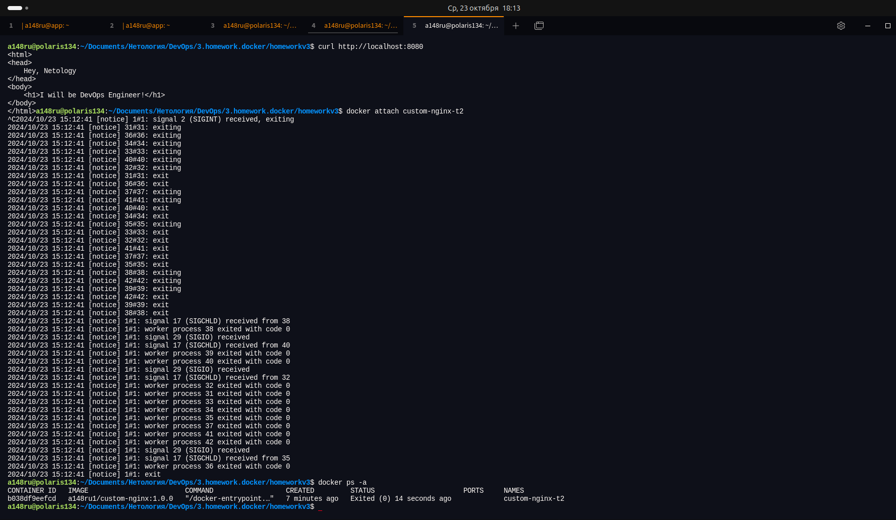
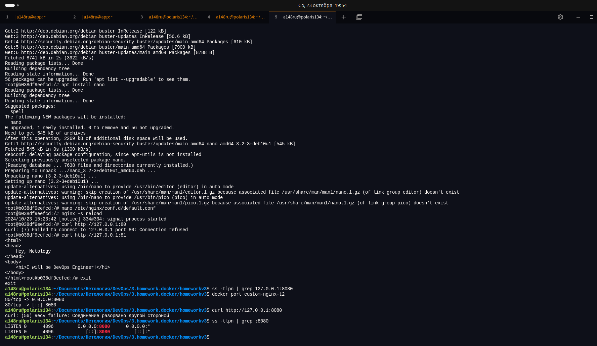
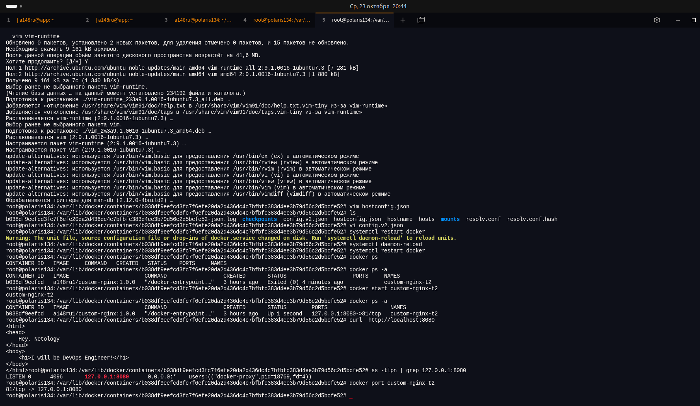
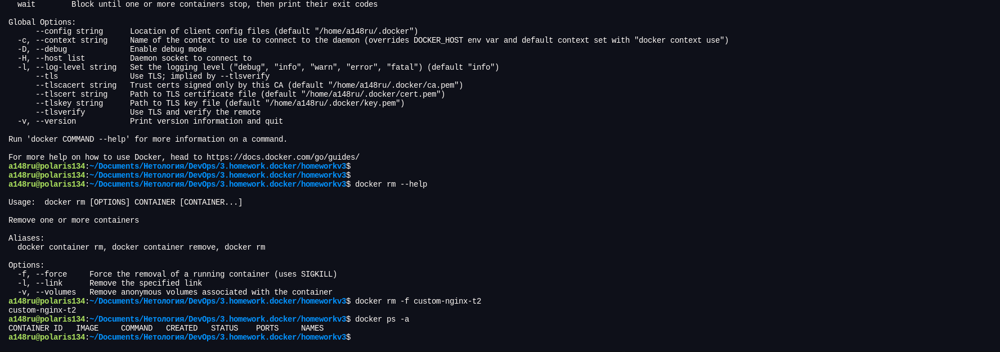

#### Задача 1

[https://hub.docker.com/repository/docker/a148ru1/custom-nginx/general](https://hub.docker.com/repository/docker/a148ru1/custom-nginx/general)

#### Задача 2



#### Задача 3

##### 3.[1-3]



контейнер остановился потому-что в стандартный поток ввода послан сигнал прерывания Т.к. управление потоком было за сервером, он закончил работу, соот-но и контейнер завершил работу.

##### 3.[4-10]



докер продолжает пересылать пакеты с 8080 порта хост машины на 80 порт контейнера, но там уже никого нет.

##### 3.11



узнать id контейнера
```bash
docker inspect --format="{{.Id}}" custom-nginx-t2
b038df9eefcd3fc7f6efe20da2d436dc4c7bfbfc383d4ee3b79d56c2d5bcfe52
```
останавливаем контейнер 
```bash
docker stop custom-nginx-t2
```

редактируем настройки:
```config.v2.json```  - исправляем ```"ExposedPorts"```
```hostconfig.json``` - исправляем ```"PortBindings"```

```bash
sudo bash
cd /var/lib/docker/containers/b038df9eefcd3fc7f6efe20da2d436dc4c7bfbfc383d4ee3b79d56c2d5bcfe52
vi config.v2.json
vi hostconfig.json
```

перезапускаем докер (у меня без перезапуска службы не сработало)

```bash
systemctl daemon-reload
systemctl restart docker
```
запустить контейнер

```bash
docker start custom-nginx-t2
```

##### 3.12



